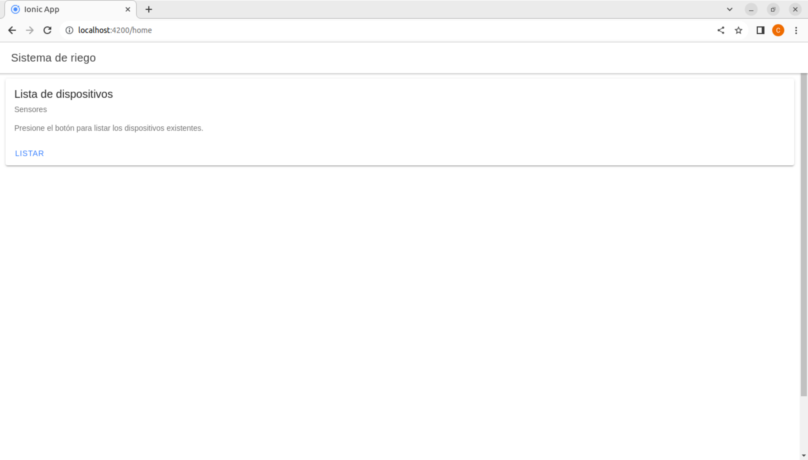
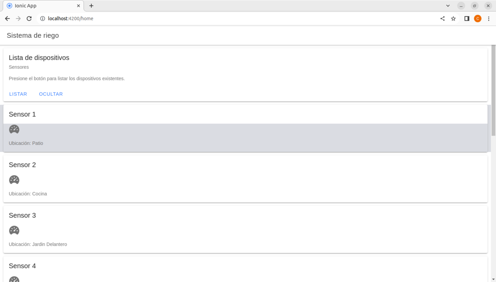
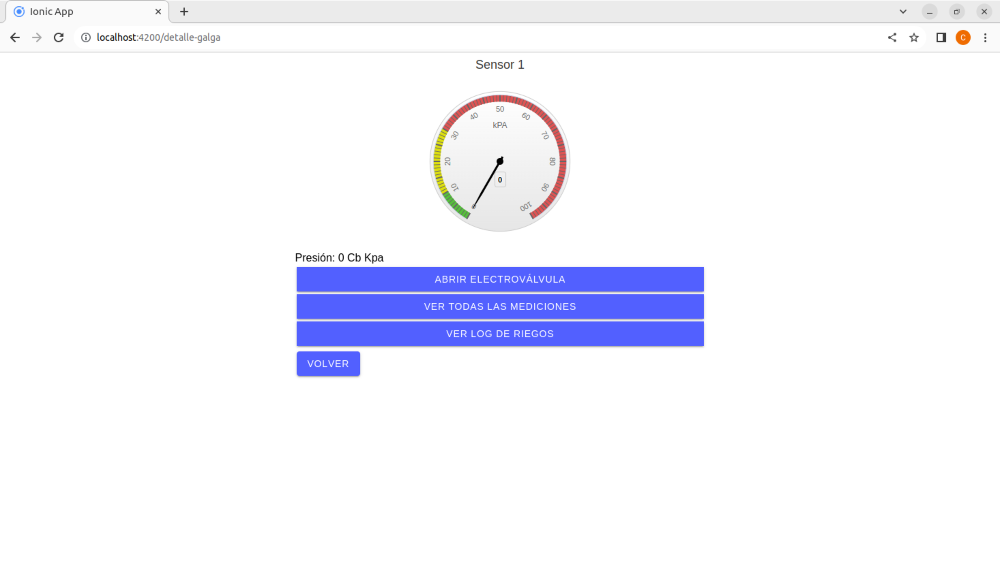
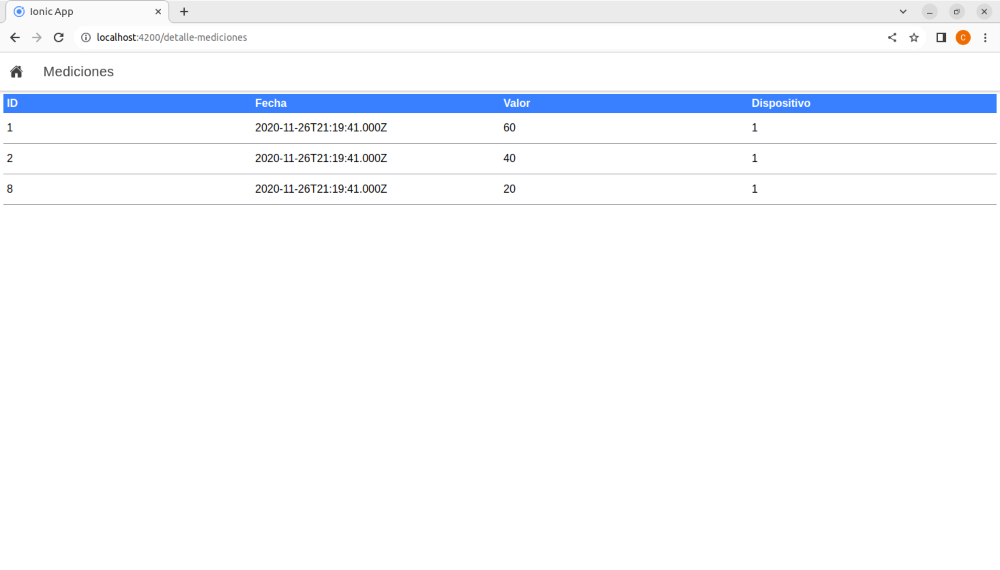
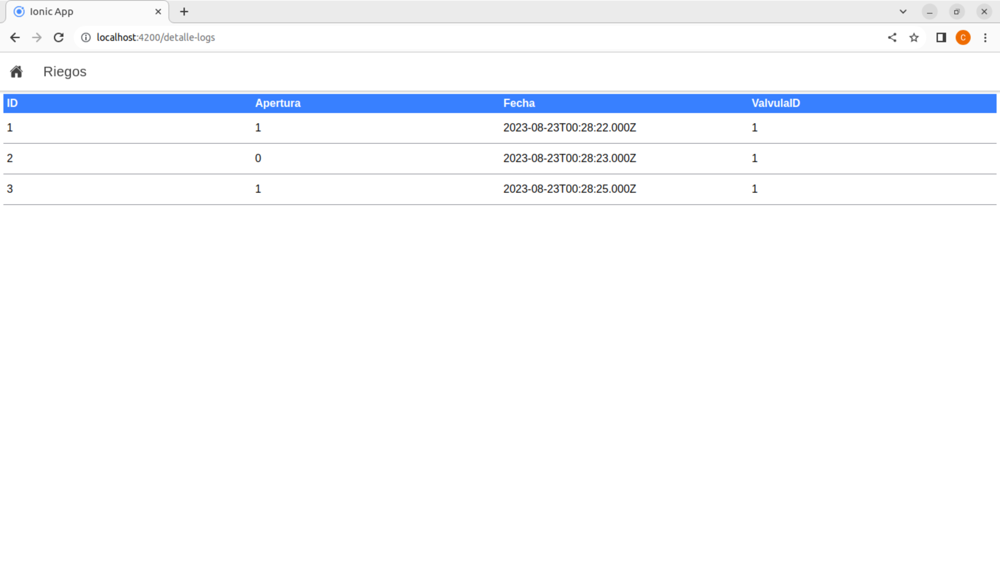

# Control de riego

## Web App Full Stack Base - Frontend Ionic

Este proyecto es una extensión de [Web App Full Stack Base](https://github.com/gotoiot/app-fullstack-base), adaptado para utilizar el framework Ionic en el frontend.

## Comenzando 🚀

Esta sección proporciona una guía con los pasos esenciales para poner en marcha la aplicación.

### Instalación de dependencias

Para ejecutar este proyecto, es necesario tener instalados `Docker` y `Docker Compose`.

Consulta la documentación del proyecto Web App Full Stack Base para obtener más detalles.

### Ejecución de la aplicación

Para ejecutar la aplicación, debes ejecutar el comando `docker compose up` desde la raíz del proyecto: `'app-fullstack-base-2022-i07/'`.

Para iniciar el proyecto de Angular/Ionic, ejecuta el comando `ng serve` en el directorio `'app-fullstack-base-2022-i07/src/frontend/dam'`.

Nota importante: si da un error por la instalación de Angular se debe ejecutar el comando `sudo npm install`. En algunas ocasiones, es posible que necesites usar privilegios de superusuario con `sudo ng serve`.

Para acceder al cliente web, abre la URL [http://localhost:4200/home](http://localhost:4200/home) en tu navegador.

Si puedes acceder tanto al cliente web como al administrador, significa que la aplicación se está ejecutando correctamente.

> Si encuentras un error la primera vez que ejecutas la aplicación, detén el proceso y vuelve a iniciarlo. Esto se debe a que el backend espera que la base de datos esté creada al inicio, y en la primera ejecución es posible que no se haya creado a tiempo. A partir de la segunda ejecución, este problema se solucionará.

### Pantallas de la aplicación

Pantalla principal:

El listado de sensores se muestra y oculta según la interacción con los botones respectivos.

Pantalla de sensores:

Pantalla de mediciones:

Pantalla de registros de riego:

### Requerimientos de la aplicación

- Dos directivas estructurales: `ngFor` para el listado de dispositivos y `ngIf` para ocultar y mostrar los dispositivos.
- Una directiva de atributo: para cambiar el color del fondo de la lista de dispositivos cuando el mouse pasa sobre los elementos.
- Un pipe personalizado: para mostrar la unidad de medida de presión en función del valor de la galga.
- Un servicio para conectarse a la API: se utiliza un servicio para gestionar cada tabla y el listado.
- Una API Express con comunicación a la base de datos.

## Licencia 📄

Este proyecto está bajo la Licencia MIT. Puedes consultar el archivo [LICENSE.md](LICENSE.md) para obtener más detalles sobre el uso de este material.

